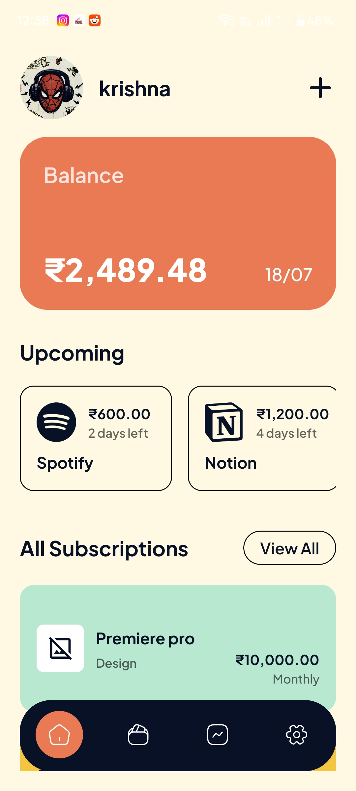
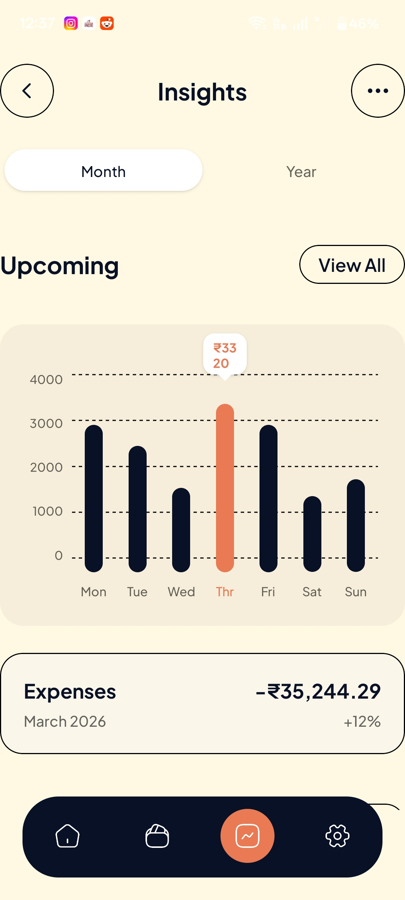
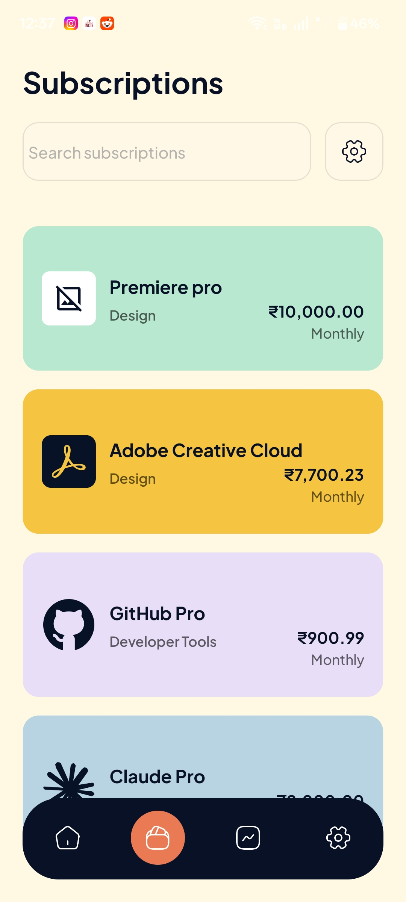
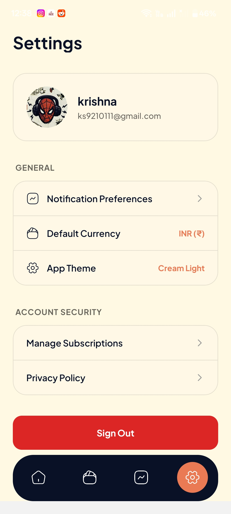

# Recurly - Subscription Manager

<div align="center">
  
  &nbsp;&nbsp;
  
  &nbsp;&nbsp;
  
  &nbsp;&nbsp;
  
</div>

Recurly is a modern, beautifully designed subscription management app built with React Native and Expo. It helps you keep track of all your recurring expenses, upcoming bills, and overall spending in one unified dashboard.

## ✨ Features

- **📊 Visual Insights**: Track your upcoming bills with an interactive bar chart and view total monthly expenses.
- **📅 Subscription Tracking**: Add, view, and manage all your active subscriptions (like Spotify, Adobe, Netflix) and their due dates.
- **🔐 Secure Authentication**: Integrated with Clerk for seamless and secure user authentication.
- **🎨 Beautiful UI**: Crafted with NativeWind (Tailwind CSS) for a premium, responsive, and cross-platform design.
- **📱 Cross-Platform**: Works smoothly on both iOS and Android.

## 🛠️ Technologies Used

- **Framework**: [React Native](https://reactnative.dev/) & [Expo](https://expo.dev/) (File-based routing with Expo Router)
- **Styling**: [NativeWind](https://www.nativewind.dev/) (Tailwind CSS for React Native)
- **Authentication**: [Clerk](https://clerk.com/)
- **Analytics**: [PostHog](https://posthog.com/)
- **Date Utilities**: [Day.js](https://day.js.org/)
- **Language**: [TypeScript](https://www.typescriptlang.org/)

## 🚀 Getting Started

Follow these steps to set up the project locally on your machine.

### Prerequisites

- Node.js (v18 or newer)
- npm, yarn, or pnpm
- Expo CLI

### Installation

1. **Clone the repository** (if applicable) and navigate to the project directory:
   ```bash
   git clone <your-repo-url>
   cd recurly
   ```

2. **Install dependencies**:
   ```bash
   npm install
   ```

3. **Set up Environment Variables**:
   Create a `.env` file in the root directory and add your required keys (e.g., Clerk Publishable Key).
   ```env
   EXPO_PUBLIC_CLERK_PUBLISHABLE_KEY=your_clerk_key_here
   ```

4. **Start the development server**:
   ```bash
   npx expo start
   ```

5. **Run on your device**:
   - Press `i` to open in iOS Simulator
   - Press `a` to open in Android Emulator
   - Scan the QR code with the Expo Go app on your physical device.

## 📸 Screenshots

To make the preview images at the top work, please save the screenshots you provided into the following directory:
`assets/screenshots/`

Name them exactly as follows:
- `home.jpg`
- `insights.jpg`
- `subscriptions.jpg`
- `settings.jpg`

---
*Built with ❤️ for a better subscription tracking experience.*
